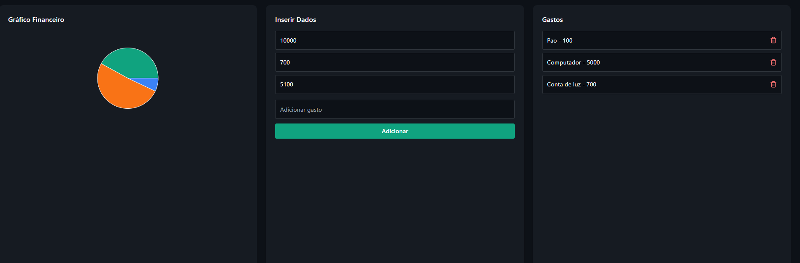

# 💼 Projeto Financeiro - Backend em Go + Frontend em React

Sistema web completo para **gerenciamento de finanças pessoais**, com autenticação de usuários e estrutura inicial para controle de transações financeiras.

---

## 📂 Estrutura do Projeto
```bash
.
├── backend # API REST em Go
└── frontend # Interface web em React + Vite + Tailwind
```
---

## 🧪 Tecnologias Utilizadas

### 🖥️ Backend
- Go (Golang)
- Gin (framework HTTP)
- GORM (ORM)
- PostgreSQL
- JWT (autenticação)
- Bcrypt (hash de senha)

### 🌐 Frontend
- React
- Vite
- TypeScript
- TailwindCSS
- Axios

---

## 🧾 Banco de Dados (PostgreSQL)

Banco: `financas`

Tabelas existentes:

- `users`: Armazena os usuários cadastrados
- `transacaos`: Estrutura pronta para futuras transações

---

## ⚙️ Como Rodar o Projeto Localmente

### 1. Clone o repositório

```bash
git clone https://github.com/seu-usuario/nome-do-repositorio.git
cd nome-do-repositorio
```
## Backend (Go)
```bash

cd backend
go mod tidy
go run main.go
```
Verifique a string de conexão no arquivo ```database/connection.go:```

```go
dsn := "host=localhost user=postgres password=SUA_SENHA dbname=financas port=5432 sslmode=disable"
```

## Frontend (React)
```bash

cd frontend
npm install
npm run dev
```
Abra no navegador: ```http://localhost:5173```
---
## 🔐 Endpoints da API

Autenticação

```POST /register``` → Criar novo usuário

```POST /login``` → Login com geração de token JWT

# 📌 Transações
*Funcionalidade em desenvolvimento*
A estrutura está criada no backend e banco de dados, mas as rotas de transação ainda estão sendo implementadas.

# ✨ Funcionalidades
Cadastro e login de usuários com JWT

Interface web com React + Tailwind

Conexão com banco PostgreSQL

Backend modularizado (controllers, models, rotas)

# 🛠️ Em Desenvolvimento
Funcionalidade de transações (CRUD)

Filtros por categoria/data

Gráficos e estatísticas financeiras

## 👨‍💻 Autor
Wesley Souza da Silva
